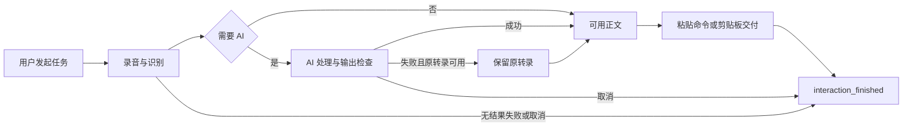
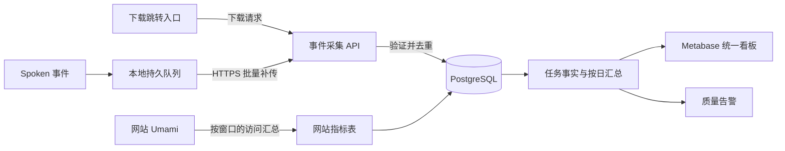

# Spoken 产品埋点与数据监控方案

状态：设计方案，尚未开发或开启客户端上报。依据 2026-09-11 本地代码和产品网站配置核对。

本文为指标与技术附录。完整改版范围、界面、排期及发布验收见[Spoken 使用统计与监控改版计划](product-analytics-revision-plan.md)。

目标：看清下载入口的使用、客户端实际活跃、每份安装的输入次数，以及从录音到交付的流失与失败原因。首版沿用无账号产品形态，统计不影响录音、模型调用和粘贴。

## 1. 当前基础与首版选择

| 项目 | 已有能力 | 需要补齐 |
| --- | --- | --- |
| 网站 | Cloudflare Pages 静态网站；Umami Cloud 浏览量、访客及 `download_click` | 下载请求统计、版本/来源汇总，与产品看板并列展示 |
| 客户端 | 本地 ASR 次数、成功/失败计数；处理耗时和 AI 结果日志 | 安装标识、任务事件、同意开关、本地队列、服务端采集 |
| 核心流程 | 快捷键→录音→ASR→可选 AI→正文检查→自动粘贴或剪贴板回退 | 一个贯穿全程的任务 ID、可靠的结束状态、统一事件字典 |
| 交付确认 | 当前发送粘贴命令后会按内部流程返回成功 | 区分“命令已发送”“仅写入剪贴板”“确认目标收到”，不将内部成功当成真实粘贴成功 |
| 用户体系 | 无账号，模型密钥由用户配置 | 使用随机安装标识，不增加注册要求 |

推荐：**保留 Umami 网站统计；新增轻量采集 API＋PostgreSQL＋Metabase 产品看板。** 客户端通过自己的采集 API 上报，数据库按明确业务规则去重和汇总。

Umami 已提供事件发送 API，并非不能接收程序事件；但本次需要跨版本的安装识别、任务/重试去重、离线补传、单安装明细和删除机制，建议由产品侧掌握这些规则。直接扩展 Umami 可用于概念验证，采用前需另行验证所选版本和套餐下的原生客户端识别、导出及幂等能力。[Umami 发送接口](https://docs.umami.is/docs/api/sending-stats)

首版只做必要服务，不引入 Kafka、实时数仓或自建分析前端。采集 API 可部署在现有 Cloudflare 的 Workers/Pages Functions，数据库与看板可采用托管或小规模自部署；具体地区与供应商在上线前确定。Pages Functions 支持服务端代码；Metabase 支持连接 PostgreSQL。[Cloudflare 文档](https://developers.cloudflare.com/pages/functions/) · [Metabase 文档](https://www.metabase.com/docs/latest/databases/connections/postgresql)

## 2. 指标口径

### 2.1 “用户”“对话”和时间

- **用户：首版指参与统计的客户端安装标识，不等于自然人。** 同一人在两台 Mac 上使用通常计两个；同一 macOS 用户目录共享的应用配置计一个。看板标为“活跃安装数”，可附注“用户数的近似口径”。
- **一次对话：一次由用户发起并被应用接受的语音输入任务。** 不要求有 AI，原样转写也计数；停止录音不是新任务；内部网络重试、ASR 重连、AI 重试均不增加对话数。用户重新开始录音才计新任务。
- 菜单栏常驻、后台保活、打开设置、切换模式、测试连接不计核心活跃。录音启动失败也反映使用意图，计“使用活跃”，另列“生成结果活跃”。
- 事件时间以 UTC 存储；经营看板统一按 Asia/Shanghai 切日。任务类指标按任务开始日期归属，跨午夜完成也不把一次任务拆成两天；阶段性能指标按对应阶段完成时间统计。
- MAU 默认指最近 30 个自然日含当天的去重活跃安装，另列“自然月活跃”。月活不是日活相加。D1/D7/D30 留存按自然日、固定 cohort 计算，只展示已到观察日的 cohort。
- 所有指标只代表同意上报且事件成功到达的安装。拒绝、未升级、长期离线用户的规模无法直接得知，不能把观测人数称为全量实际人数，也不能直接外推全量 DAU。

### 2.2 下载与激活

| 指标 | 口径 | 解释边界 |
| --- | --- | --- |
| 网站 PV / UV | 采用 Umami 自身口径 | 是网页访问，不是产品活跃；UV 不跨天直接求和 |
| 下载按钮点击量 | `download_click` 次数 | 现有能力；不是下载完成量 |
| 下载点击用户数 | 同一报告窗口内，Umami 去重的下载点击访客 | 与该窗口网站访客计算网页内转化；不用点击总次数除以 UV |
| 下载请求量 | 下载入口收到有效 GET 并返回安装包跳转，按 `download_request_id` 去重 | 独立命名；不称下载成功。排除 HEAD、已知机器人和预取，仍可能存在重复请求 |
| 文件完整传输估计量 | 可选，依赖 CDN/源站传输日志、状态及字节覆盖 | 分片、续传、缓存和中途断开需专门处理；服务端传完不证明用户保存到磁盘 |
| 新增可观测安装 | 服务端首次看到一个有效 `installation_id` | 包含老用户升级后首次同意统计，不能全部叫新增用户 |
| 新安装首次启动 | 首次运行时已同意统计、且本地确认没有历史安装标记的安装 | 未同意时不报；历史版本无法确认时记 `unknown`，不猜测 |
| 首次激活 | 该安装第一次任务 completed 且 result_ready=true | 包含 AI 失败后保留原转录；不含用户取消；不等于确认目标应用收到文本 |
| 7 日激活率 | 某首次观测 cohort 在首次观测后 7×24 小时内激活的安装数 / 该 cohort 安装数 | 单独展示 fresh / existing / unknown；分母仅用完整观察窗口 |
| D1 / D7 / D30 留存 | 首次激活日为 D0，在第 N 天发起任务的安装数 / D0 激活安装数 | 固定日留存，不混用“之后任一天回来”；关闭统计造成的缺失无法与流失完全区分 |

**下载→安装首版是两段观测，不能冒充已闭环的用户级漏斗。** 网站浏览器标识不会自动进入 DMG 中，也不会自动传给首次启动的 App。因此不能用“当天首次启动 / 当天下载点击”命名安装转化率。

P0 保留现有下载链接与 Umami 事件；新增 `/download` 跳转入口，用服务端统计下载请求，计数失败仍跳转。保持旧 DMG 直链可用，标记直链绕过统计的覆盖缺口；跳转响应不缓存，安装包仍由 CDN 提供，不为统计反向代理整个大文件。

P1 才做可选归因：下载时签发短期随机 token，用户安装后主动打开“关联本次下载”的应用链接或输入来源码。token 不含个人信息，设置过期、单次绑定和明确告知；只计算成功关联样本的转化率，同时展示关联覆盖情况，不能代表所有下载。另一种轻量方案是用户可跳过的来源选择。**不按 IP、设备指纹、API Key 或文件名猜测同一用户，不动态修改已签名安装包来塞入身份。**

### 2.3 活跃与单用户核心数据

| 指标 | 计算方式 |
| --- | --- |
| DAU | 当天存在有效 `interaction_started` 的去重安装数 |
| WAU / MAU | 最近 7 / 30 天存在有效 `interaction_started` 的去重安装数 |
| 生成结果 DAU | 当天开始的任务中，至少一次 `result_ready=true` 且未取消的去重安装数 |
| 人均对话数 | 同窗口任务数 / 同窗口活跃安装数；同时展示中位数、P90，避免少数重度用户拉高均值 |
| 单安装对话数 | 对该安装统计去重 `interaction_id`；支持今天、7 天、30 天、自选窗口及统计期间累计 |
| 单安装使用天数 | 窗口内有任务的自然日数 |
| 处理完成量 | `terminal_state=completed` 的任务数；完成指应用处理和交付尝试流程结束，不声称真实粘贴已被验证 |
| 取消 / 无结果失败 / 中断量 | 分别统计 `cancelled`、`failed`、`interrupted`；未收到结束事件单列 `pending/unknown` |
| 完成率 | completed / 全部已结束任务；同时显示 started、pending 数，避免漏报终态抬高完成率 |
| AI 后处理使用率 | 实际进入 AI 阶段的任务数 / 总任务数；原样转写加翻译也可能进入 AI |
| AI 成功率 | AI 逻辑请求成功数 /（成功＋失败）；取消及未结束单列，不把网络重试算成新分母 |
| AI 回退率 | 实际进入 AI 阶段且因 AI 错误保留原转录的任务数 / 实际进入 AI 阶段且已结束的任务数；与任务完成量可以重叠 |
| 语音输入量 | 每安装和整体录音时长、ASR 输入字数、最终正文字数；只报数值，不报内容 |
| 模式与模型分布 | 按停止录音时冻结的模式、模型供应商、模型枚举、思考开关统计实际使用次数 |
| 自动交付情况 | 分别统计 paste_dispatched、clipboard_only、paste_verified、failed；只在有可靠观测时使用 verified |
| 体验耗时 | 停止录音→ASR 结束、AI 耗时、停止录音→交付流程结束，展示 P50/P90/P95；成功与回退分开 |

“累计”从该安装开始参与统计时起计，不包含启用前的历史语音；重置标识或删除历史后不延续。界面必须显示累计起点和可查询明细时间范围。

## 3. 统一身份与事件设计

### 3.1 标识与关联

| 字段 | 作用与生命周期 |
| --- | --- |
| `installation_id` | 本地随机 UUID；保存在 Application Support。升级和保留配置的重装沿用；清配置、重置或重新同意后的新身份不强行与旧记录关联 |
| `app_session_id` | 每次进程启动随机生成；用于排查，不用它计算 DAU/MAU |
| `interaction_id` | 快捷键任务被接受时创建，覆盖录音、ASR、AI、回退及交付 |
| `ai_request_id` | 一次逻辑 AI 处理，包括其网络重试；属于同一 interaction |
| `attempt_id` | 每次实际 HTTP 尝试一个；只用于请求级统计 |
| `event_id` | 事件入本地队列时生成，补传时复用；服务端唯一键防重复 |
| `consent_epoch` | 同意版本/周期；撤销后禁止旧周期队列继续上传 |
| `download_request_id` | 下载入口请求标识，与 installation_id 默认没有关联 |
| `account_id` | 预留空字段；将来引入账号且获得相应授权后才建立映射，不改变原事件主键 |

服务端可将 installation_id 显示为简短化名。API Key、模型连接名称、自定义 Prompt 都不能用于用户识别。随机稳定 ID 是可关联的去标识化标识，不宣传为“完全匿名”。

重新开启或重置会产生新身份，首次观测可能包含同一设备的新统计周期，因此不等于净新增安装。客户端能确认已有使用历史时标为 existing；服务端不跨新旧身份自动去重为同一自然人。

### 3.2 公共字段与属性约束

每个客户端事件包含：`event_id`、`event_name`、`schema_version`、`occurred_at`、`installation_id`、`app_session_id`、`consent_epoch`、`app_version`、`app_build`、`environment`、`distribution_channel`、macOS 主/次版本及架构。服务端补充 `received_at`、校验状态和时间质量。

distribution_channel 是构建/分发包的渠道，不是实际获客来源：同一个官网安装包被朋友转发后仍是官网包。acquisition_source 只有明确关联或用户自报时才填写，其余为 unknown。模型事件另带 purpose=input/connection_test，测试连接不进入对话、活跃及正常输入的成功率。

任务事件带 interaction_id；模型事件再带 ai_request_id / attempt_id。时长由客户端单调时钟计算，墙上时钟只用于日期归属。默认只保留必要精度，时长取整到毫秒或秒，具体见事件字典。

尚未进入的阶段不强行填写字段，未知耗时使用 null，不用 0 冒充测量值；配置锁定失败时标记 configuration_invalid，不从后来修改的设置中补出虚假的模式或模型。服务端 schema 按事件和 purpose 规定必填/可空条件。

mode_kind 为 builtin/custom；预设模式用稳定 ID，自定义模式只报本地随机 ID及自定义数量，不报名称或规则。模型与供应商用枚举；用户手填的未知模型归为 `custom_model`，不上传任意自由字符串、Base URL、workspace ID 或连接名称。错误用预定义 error_code，不直接上报服务器报错原文或 `localizedDescription`。

完整事件字典：[product-analytics-events.csv](product-analytics-events.csv)。P0 是首版必需，P1 为扩展诊断与行为分析。

### 3.3 一个任务只有一个业务终态



终态字段拆为三组，避免把业务成功与技术失败混为一谈：

- `terminal_state`：completed / failed / cancelled / interrupted。没有终态事件是 pending，超观察阈值后可派生 unknown，不伪造 failed。
- `processing_outcome`：raw_transcript / ai_success / original_fallback / no_result；`result_ready` 说明是否生成非空可用结果。fallback 是处理结果的属性，不另计一次任务。
- `delivery_outcome`：paste_dispatched / clipboard_only / paste_verified / failed / not_attempted；附带 target_unavailable、permission_missing、clipboard_write_failed 等枚举原因。

completed 要求 result_ready=true，且交付流程至少成功写入剪贴板或发出粘贴命令；写入剪贴板失败、又无其他可确认交付方式时记 failed。另保留 `ai_requested` 标记是否实际进入 AI 逻辑阶段：配置或 ASR 提前失败不能混进模型本身的失败分母，单列 configuration_invalid / asr_failed。

原转录可用且 AI 超时：AI 失败一次、回退一次、任务仍可能 completed。AI 成功但用户取消：任务 cancelled，不计交付完成。权限不足、只复制到剪贴板：记录 clipboard_only，不误报自动粘贴成功。

当前代码的 `InjectionOutcome.inserted` 与 `PipelineLatencyMetrics.finish()` 不足以证明目标应用实际收到文本。实施时需要保留其观测能力边界，并检查剪贴板写入的返回值；不为统计读取目标输入框文本或剪贴板全文。

任务控制器统一发终态；ASR、AI、UI 回调只更新该任务状态。结束事件含停止时冻结的模式、模型、语言和思考参数；录音中切换模式不改变任务 ID，停止后修改设置不改变这次任务的归因。

## 4. 采集、存储与计算



### 4.1 客户端可靠上报

新增 `TelemetryClient` 与 SQLite outbox，通过独立 actor/串行队列运行，避免共享录音线程。任务主流程先完成，统计不得阻塞 UI、录音、ASR、AI 或粘贴，也不弹网络失败提示。

建议初始参数：每 20 条或队列中有数据满 60 秒批量发送；单批最多 50 条、100 KB；连接失败指数退避加随机抖动，上限 1 小时；队列最多 10 MB / 10,000 条 / 7 天，先丢过期及低优先级事件。没有待发事件时不持续定时唤醒。

服务端只在数据库事务提交后确认 event_id。部分成功逐项 ACK，已确认才出队；重试复用原 event_id 和 occurred_at。413 拆批，429 按 Retry-After，临时 5xx/断网重试；字段错误等永久 4xx 丢弃并记非内容计数，不能把一条坏事件无限重传。

本地持久化任务开始标记与终态。崩溃后下次启动可补报 `interrupted`，注明 recovered=true 和结束时间未知，按原任务开始时间归属；不能把下次启动当作上次崩溃发生时间。如果用户不再启动，服务端只能看到 unknown，不能据此判断卸载。

模式、结果和终态写入应采用本地事务；服务端同时按 event_id 与业务键去重。`interaction_finished` 的业务唯一键为 installation_id＋interaction_id，`ai_attempt_finished` 为 installation_id＋attempt_id；乱序到达先暂存，聚合不依赖到达顺序。

### 4.2 服务端接口与保护

| 接口 | 用途 |
| --- | --- |
| `POST /v1/telemetry/enroll` | 用户同意后登记随机安装标识，返回仅限该安装的写入/删除凭证 |
| `POST /v1/events/batch` | 验证字段白名单、类型、长度和时间；持久化并返回逐条 ACK |
| `DELETE /v1/telemetry/installation` | 用户请求删除本安装的可关联数据，并撤销凭证 |
| `GET /download` | 校验固定产品资源枚举，计请求并跳转，不接受任意外站跳转地址 |
| 内部聚合任务 | 更新任务事实、日汇总、累计计数及告警查询；不暴露为公共写接口 |

凭证不是客户端内置共享管理员密钥，也不复用用户的模型密钥。它可以减少串写和误写，但开源客户端仍可被仿造，不能保证事件全部来自真实人。入口需做大小限制、安装级限速、短期网络滥用限速、异常流量隔离和测试环境分离；安全限制不使用长期设备指纹。

production/staging/test 由服务端入口和凭证共同决定，不只信任客户端上传的 environment 字段。下载服务计数路径异常应仍返回跳转；整个跳转入口不可用时，页面保留原始 DMG 下载备用链接。

完整请求体不写代理日志、错误追踪或调试平台。数据库与 BI 不公开，BI 用只读账号；原始明细只向必要维护者开放，普通运营使用汇总与受限安装页。备份、日志和导出同样遵循数据生命周期。

### 4.3 数据层

| 表/视图 | 粒度与作用 |
| --- | --- |
| `events_raw` | 一条合法事件；event_id 唯一，保存结构化白名单字段 |
| `installations` | 一份安装；首次观测、安装来源状态、首次激活、当前版本、同意周期 |
| `interaction_fact` | installation_id＋interaction_id 唯一；start、终态、处理和交付状态、冻结配置、耗时 |
| `ai_attempt_fact` | 每次实际 HTTP 尝试；与逻辑任务关联，不增加对话数 |
| `installation_daily` | 安装＋业务日期；输入次数、结果次数、模式分布、活跃标记 |
| `installation_totals` | 按去重任务增量更新的统计期间累计；同意重置/删除时清理 |
| `website_metrics` | Umami 原始报告窗口＋维度＋口径的汇总，附 source 和更新时间 |
| `download_requests` | 下载请求及资源、来源枚举；不默认关联安装 |

网站汇总通过服务端凭证读取 Umami 或受控导出接入，凭证不进入网站或 App；具体 API 与套餐权限上线前验证。UV 必须保存原查询窗口及维度，月 UV 不能由日 UV 相加，分渠道 UV 也不能随意求和。历史 Umami download_click 不迁移成下载完成事件。

事件用 occurred_at 计算行为指标、received_at 计算上报时延。超过 7 天的补传或超过容许未来偏移的事件进入排除/隔离规则；客户端时钟明显异常的记录保留 time_quality 标记，不能静默移动到当天抬高 DAU。容许未来偏移初始建议 5 分钟。

看板 5–15 分钟刷新；每日重算最近 8 天应对补传，D0 数据标为暂定、7 天窗口结束后标为稳定快照。稳定指本系统接收窗口结束，不代表覆盖全部用户。异常未配对任务单列 unknown，迟到的合法终态可修正派生状态。

### 4.4 计算示例

以下为 PostgreSQL 查询示意，假设 interaction_fact 已过滤测试、非法及重复事件，且一行代表一个任务。

```sql
-- 任意业务日期的 DAU 与对话数。
SELECT
  (started_at AT TIME ZONE 'Asia/Shanghai')::date AS business_date,
  COUNT(DISTINCT installation_id) AS active_installations,
  COUNT(*) AS interactions,
  COUNT(*) FILTER (WHERE terminal_state = 'completed') AS completed,
  COUNT(*) FILTER (WHERE processing_outcome = 'original_fallback') AS ai_fallbacks
FROM interaction_fact
GROUP BY 1;

-- 某份安装在明确的 UTC 起止窗口中的使用情况；结束边界不包含。
SELECT
  COUNT(*) AS interactions,
  COUNT(DISTINCT (started_at AT TIME ZONE 'Asia/Shanghai')::date) AS active_days,
  COUNT(*) FILTER (WHERE terminal_state = 'completed') AS completed,
  COUNT(*) FILTER (WHERE terminal_state = 'cancelled') AS cancelled,
  COUNT(*) FILTER (WHERE terminal_state = 'failed') AS failed
FROM interaction_fact
WHERE installation_id = :installation_id
  AND started_at >= :window_start_utc
  AND started_at < :window_end_utc;
```

MAU 对最近 30 个业务日期范围重新 COUNT DISTINCT installation_id；按日、版本或模式展示的去重人数不能相加得到全局去重人数。累计表仅在首次接受一个业务事实或确定状态变化时更新，同一 ACK 重试不能再加一次。

## 5. 看板与监控

### 5.1 四张产品看板

| 看板 | 主要内容 | 决策用途 |
| --- | --- | --- |
| 获客与激活 | 网页 UV、点击量、请求量、首次可观测安装、首次激活、成熟 cohort 激活率、版本与来源 | 判断用户在哪一段流失；明确展示下载与安装尚未关联 |
| 活跃与使用深度 | DAU/WAU/MAU、生成结果 DAU、人均/中位/P90 对话数、D1/D7/D30 留存、使用天数、模式和模型分布 | 判断产品是否被持续使用、哪些场景有价值 |
| 单安装使用页 | 化名 ID、首次/最近使用、今天/7天/30天/统计期间累计次数、活跃天数、完成/取消/失败、录音时长、常用模式、最近非内容事件 | 回答“这个用户用了几次、最近是否活跃、是否遇到问题”；没有录音或对话正文 |
| 质量与数据健康 | ASR/AI 成功率、回退率、unsafe_output、自动粘贴命令与剪贴板回退、分阶段耗时、事件延迟、丢弃/拒绝/重复/缺终态比例 | 判断模型、版本、权限或上报链路异常 |

看板统一筛选日期、版本、分发渠道、预设/自定义、供应商和模式；低样本格子标为样本不足。每张页面显示时区、数据更新时间和“仅覆盖参与统计安装”。不以提示词内容或原文做用户分群。

### 5.2 初始告警规则

阈值是上线初始建议，先观察 7–14 天基线后调整；比率告警须同时满足最小样本量。

| 告警 | 初始触发条件 | 排查方向 |
| --- | --- | --- |
| 采集接口不可用 | 隔离监控环境的合成探针连续 3 次失败，每 5 分钟一次 | DNS、接口、数据库；不混入生产 DAU |
| 采集错误 | 15 分钟至少 100 次请求且 5xx >1% | 入库、限流配置和发布 |
| AI 回退异常 | 30 分钟至少 50 个已结束 AI 任务，回退率 >10% 且超过近期同类基线两倍 | 按供应商、模型、版本和 error_code 下钻 |
| 疑似思考输出 | 1 小时至少 3 个 unsafe_output，且涉及至少 2 份安装 | 分离正常拦截与新格式回归；告警不包含异常正文 |
| 粘贴退化 | 1 小时至少 50 个有结果任务，clipboard_only 占比相对基线上升 15 个百分点 | 辅助功能权限、目标应用失焦、签名升级 |
| 处理变慢 | 30 分钟至少 50 个成功任务，停止→交付 P95 比同模式/长度档基线增加 50% 且至少增加 2 秒 | ASR、AI、交付阶段分别检查 |
| 数据质量 | 同样本窗口内非法/未知 schema >0.5%，或在线样本上报延迟 P95 >15 分钟 | 发布兼容、客户端队列；离线补传另列 |
| 活跃异常下降 | 稳定日 DAU 相对过去 4 个同星期中位数下降 >30%，且基线至少 50 | 先检查上报、版本与同意覆盖变化，再判断业务流失 |

告警同一问题合并、设置冷却与恢复通知。可由 Metabase 保存的查询触发，发送到邮件或 webhook；接入飞书时再明确通知对象和授权，本轮不创建或发送消息。Metabase 官方文档提供查询告警及通知通道配置。[告警文档](https://www.metabase.com/docs/latest/questions/alerts)

## 6. 产品端的数据选择与保留

- **建议首版可选统计默认关闭。** 首次使用提供简短说明，用户可直接继续使用；设置页可随时开启、关闭，提供“删除历史并重置统计标识”入口。
- 不同意时不登记安装、不联网报客户端行为、不缓存待补传行为；允许保留已有的本地诊断计数。开启后从此刻开始统计，不回补开启前历史。首次观测与真实首次安装分开标记。
- 关闭时立即停止、取消在途请求并清空本地待报队列。已送达的数据按保留规则处理；“关闭统计”和“删除历史”分别说明。重新开启使用新同意周期/身份，不自动拼接旧身份。
- 本机在 Keychain 中保留当前及旧周期的最小删除凭证清单，仅用于主动删除，不上传身份间的关联。“删除历史并重置”先关闭统计，再逐个删除本机仍持有凭证的身份；部分失败保留待重试凭证，全部确认后保持关闭。清除本机配置和 Keychain 后，不能承诺自动定位旧身份。
- 删除使用安装专属凭证，在服务端撤销接收并清除该安装原始明细、任务事实、按日汇总、累计及资料；迟到请求不得复活已删除身份。撤销记录只保留用于拒绝旧凭证的最小散列与过期时间。
- 离线删除显示“待联网完成”，只保留执行删除所需的最小凭证；确认前不能显示删除成功。备份恢复时重放删除清单，备份按周期自然淘汰。
- 首版不上传音频、ASR 原文、AI 正文、思考过程、Prompt、个人背景、密钥、Base URL、窗口标题、文件路径、剪贴板内容或具体目标应用身份。不接入会话回放、键盘采集或自动截屏。
- 可选的目标应用类别仅 P1 考虑，客户端映射成 editor/browser/chat/other，不报应用名、网址或窗口内容。Free-text 属性默认拒绝。
- 原始事件和任务明细建议保留 90 天；安装按日汇总 400 天；累计资料在该安装持续参与统计期间保留，连续 400 天无活动后删除可关联资料。按上述窗口删除明细不误清累计，用户主动删除则全部清除；看板注明统计起点及明细期限。备份建议最长 30 天。
- 网络必然会向接收端暴露连接来源，不能声称系统完全看不到 IP；产品分析表不保存 IP，也不靠 IP 跨端关联。边缘/反向代理安全日志需单独配置最短必要保留期和访问权限。
- 上线前确定数据存储地区、处理服务清单和隐私说明；网页原有统计设置不能代替用户对客户端行为统计的选择。关闭统计者的数量与同意率在此方案下无法完整测量，不另加隐蔽事件去补分母。

## 7. 实施顺序与验收

### 7.1 开发落点

| 模块 | 计划改动 |
| --- | --- |
| 新增 `TelemetryClient` / `TelemetryStore` | 类型化事件、安装身份、同意状态、SQLite 队列、补传、删除与环境隔离 |
| `AppDelegate` / `RecordingViewModel` | 创建 interaction_id；统一任务终态；冻结实际模式和模型；交付结果、取消、中断恢复 |
| `SpeechService` | 输出 ASR 终态、输入时长/字数、实际使用的识别提供方及降级结果 |
| `AIProcessingService` / `AIOutputGuard` | 关联逻辑请求、内部尝试、耗时和结果枚举；清理与 unsafe_output 计数，继续不报内容 |
| `TextInjectionEngine` / `KeyboardService` | 用实际能观测到的交付枚举替代笼统成功，不读目标文本用于验证 |
| `ModeStore` / `ModelConnectionStore` | 只在保存或选择成功后记录行为，草稿编辑不持续上报 |
| 设置页 | 可选统计、数据说明、标识重置、历史删除及待完成状态 |
| 网站下载入口 | 保留 Umami；增加请求统计与兼容跳转，确定 CDN 日志可用性 |
| 服务端 / 数据看板 | 白名单校验、凭证、去重、事实表、指标查询、看板和受控告警 |

已有日志仅作排查线索，不直接整包上传。现有 PipelineLatencyMetrics 的每指标最近 50 个本地样本不能当成全体用户历史或用于重建 DAU。

### 7.2 分两期交付

**P0：先回答“有多少人在用、每人用几次”。** 落地同意与安装识别、任务开始/结束、ASR/AI 逻辑结果、模式切换、下载请求、四张基础看板和采集可用性监控。按客户端→采集 API→事实表→看板完成完整验收后再公开发布。

**P1：解释“为什么留存或流失”。** 补齐内部请求尝试、配置和权限事件、高级留存分群、性能/版本告警；基础 D1/D7/D30 查询与展示由 P0 核心事件支持。在确有增长归因需求时增加用户主动下载关联。只有查询性能或数据规模证明有必要时才引入列式分析存储。

工作量估计：客户端及队列 3–5 人日，采集/存储/删除 2–4 人日，指标/看板/下载入口 2–3 人日，端到端与隐私验收 2–3 人日；P0 合计约 9–15 人日。为现有代码基础上的估算，托管资源、域名及发布渠道准备时间另计；P1 在 P0 验收后单独排期。

### 7.3 必须通过的验收

1. 合成安装 A 同一天做 3 次录音、其中 1 次 AI 网络重试：DAU=1，对话数=3，重试只增加实际 HTTP 尝试数。
2. A 跨天继续使用，安装 B 当天使用：当天 DAU=2，跨天窗口去重仍为 A、B 两份，不按启动次数累加。
3. 开机常驻一整天、只打开设置或测试连接：核心 DAU=0，对话数=0。
4. 原样转写、AI 成功、AI 回退原文、无结果失败、取消各走一遍：任务总量不重复，回退和任务完成可同时出现但不相加为新任务。
5. AI 成功而自动粘贴不可用：显示 clipboard_only，不显示 paste_verified；前台焦点变化、权限缺失和剪贴板写失败分别归因。
6. 同事件批次重复发 10 次、终态回调重复、事件乱序：指标不变；断网补传仍归原日期，不把积压变成当天增长。
7. 模式录音中切换、停止后修改配置：只按停止时冻结的模式归因。
8. 崩溃后恢复、卸载后不再启动、终态迟到：分别为可恢复中断/未知/修正事实，不把无消息当成卸载。
9. 默认关闭、撤销、离线删除、重新开启：抓包确认没有未同意的客户端事件、没有旧队列补传、删除回执真实、旧凭证不能重新写入。
10. 检查所有请求、日志、数据库、错误追踪和备份样本：没有语音、正文、Prompt、密钥或具体目标窗口信息。
11. 使用 production/staging/test 三套隔离标识与存储；合成探针、开发者联调、预览网站不进入正式用户数。
12. 下载点击、跳转、直接 DMG、HEAD、重复 GET、下载中断分别检查；看板名称与实际观测一致，不出现“点击即安装”。
13. 在同一机器对比埋点开/关各至少 100 次合成流程；主线程不等待磁盘/网络，单次入队 P95 目标 <2 ms，队列受限且服务断开不影响产品可用性。
14. 指标查询用固定合成数据集验证 DAU、30 日去重、cohort 成熟窗口及取消/失败分母；服务端与客户端队列损坏、ACK 丢失、删除后迟到均要覆盖。

## 8. 资源预算与上线前待定项

用事件量估算资源，而不是先承诺免费可用。例如 200 DAU、每人每天 12 个任务、每任务平均 7 个事件、30 天，约 50.4 万条/月；加启动、配置与重试事件预留约 20%。若平均事件约 0.6–1 KB，则约 0.3–0.6 GB/月原始负载，数据库索引、副本、日志和备份另计。这是容量假设，不是当前真实使用数据或供应商报价。

当前体量优先用现有网站统计加小型服务和数据库；是否使用托管 PostgreSQL、托管 Metabase或自行维护，应按可接受月预算及运维能力选择。实施前根据实际地域、套餐、事件数及保留时长核价，不自动开通付费服务。

上线前需要确定的三项：

1. 数据存储地区、服务提供方和月度预算。
2. 是否采用本方案建议的“默认关闭、用户主动同意”统计方式。
3. 是否首版就需要用户级下载归因；建议先保留聚合下载数据，待产品活跃稳定后再加关联流程。

无需现在引入账号体系、采集语音内容或重建产品网站。先把“一份安装、一次任务、一个终态”的口径和上报可靠性做好，再扩展分析深度。
